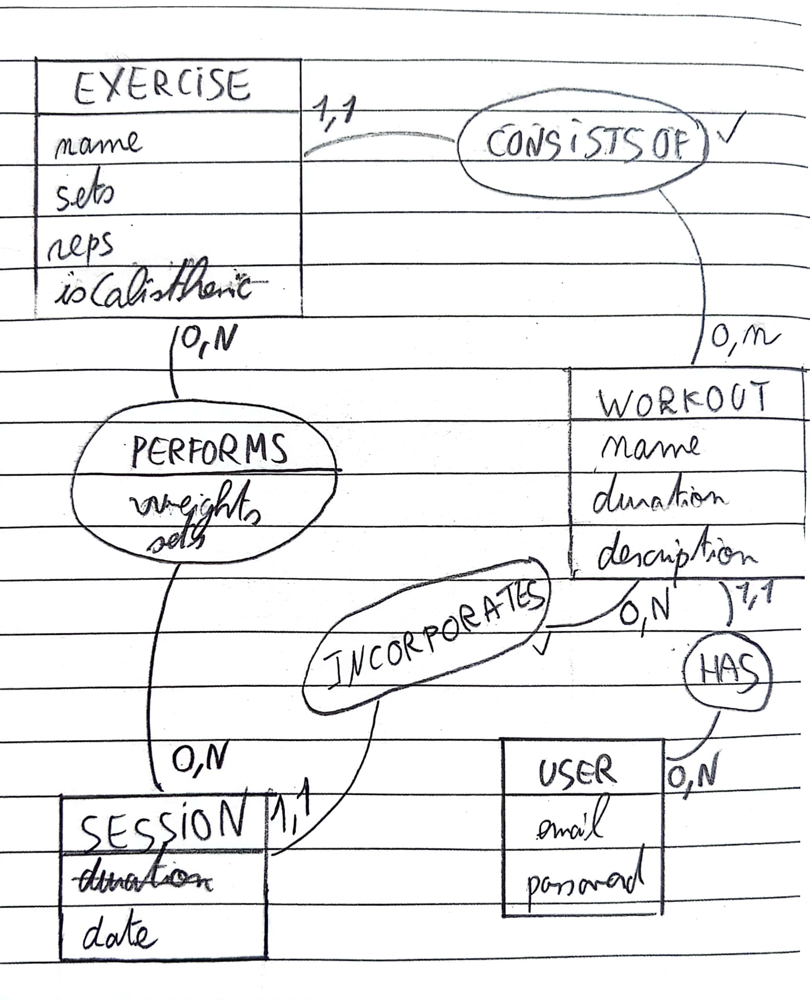

# Formation React Native

## Présentation

### Descriptif du projet

Le projet concerne une application de salle de sport qui vise à aider les utilisateurs à planifier et suivre leurs séances d'entraînement. Dans cette application, les utilisateurs peuvent créer des programmes d'entraînement, appelés **Workouts** qui sont composés de plusieurs exercices (**Exercises**).
Chaque exercice est associé à un ou plusieurs programmes d'entraînement. Pendant une séance, les utilisateurs effectuent les différents exercices qui y sont inclus. La relation entre les séances et les exercices est de type many to many, car une séance peut inclure plusieurs exercices et un exercice peut être présent dans plusieurs séances.
Les détails de chaque exercice effectué pendant une séance, tels que le nombre de séries, de répétitions et le poids utilisé, sont enregistrés dans une table associative appelée **SessionExercice**. De plus, les séances sont liées aux programmes d'entraînement auxquels elles appartiennent, établissant ainsi une relation de type « un à plusieurs » entre les séances et les programmes d'entraînement (**Workouts**).

### Vues du projet que nous allons développer ensemble

- Inscription et Connexion
- Liste de Workouts
- Edition de Workout
- Detail d'un Workout
- Faire une session d'entrainement
- Voir l'historique de mes sessions

### Modele conceptuel de données



#### Calisthéquoi ?

> Un exercice **calisthénique** est une forme de gymnastique qui utilise le poids du corps pour renforcer la musculature. Cela inclut des mouvements comme les pompes, les tractions, les squats et les planches, qui peuvent être pratiqués presque partout sans besoin d'équipement spécifique.

Dans notre cas, cela signifie que pour ce type d'exercice, nous n'avons pas besoin de stocker un poids, mais seulement des répétitions : je fais 4 fois 10 tractions.

### API et comptes d'essai

Le Swagger de l'API que nous allons utiliser est dispo ici :

https://x8ki-letl-twmt.n7.xano.io/api:-RcaJnby

#### Compte d'essai possédant des données

| Nom            | Email               | Mot de passe |
| -------------- | ------------------- | ------------ |
| Ronnie Coleman | ronnie@n2.solutions | 12345678A#   |

---

## Commandes

🚨 Sur Windows, privilégier l'invite de commande système (cmd) plutot que Git Bash / WSL pour lancer le serveur expo.

### Lancer le serveur expo

```bash
npm install

npm start
```

### Lancer le storybook

```bash
npm storybook
```

### Lancer les tests

```bash
npm test
```
